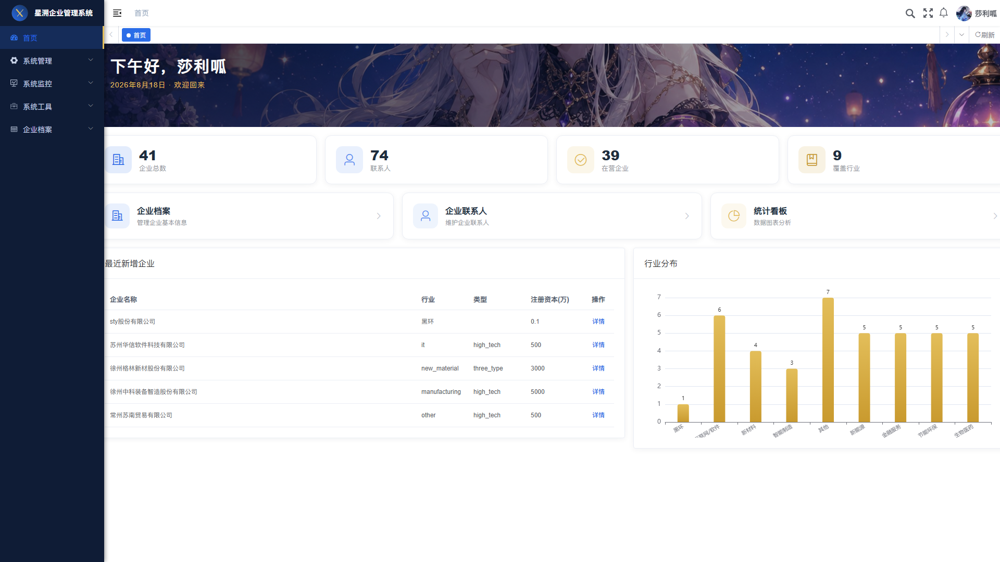
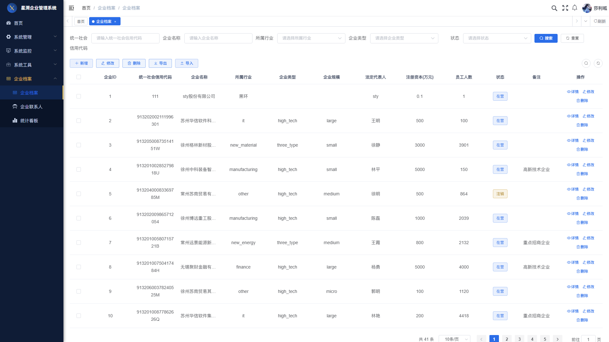
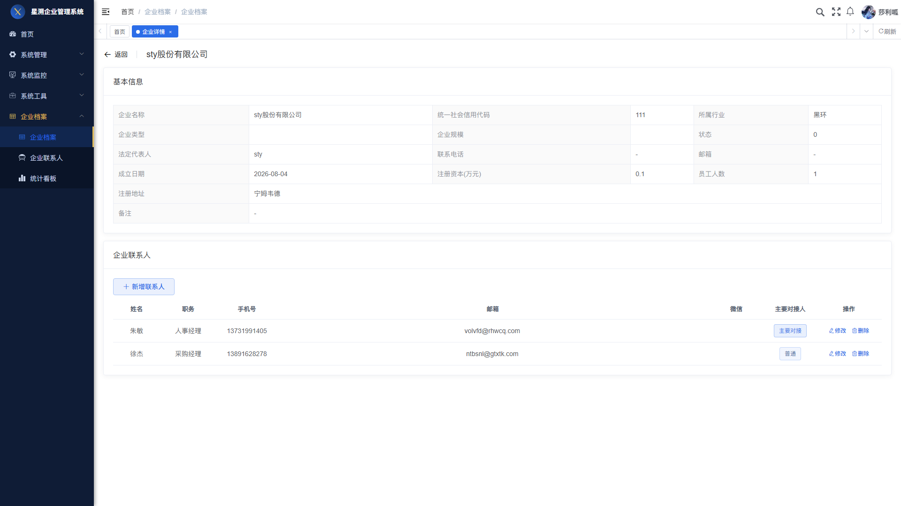
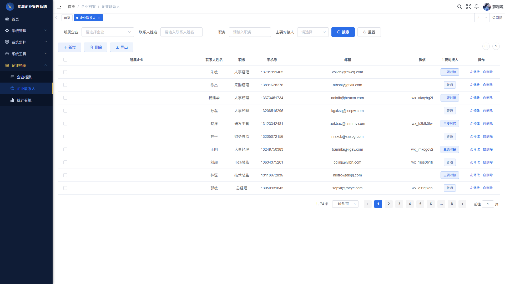
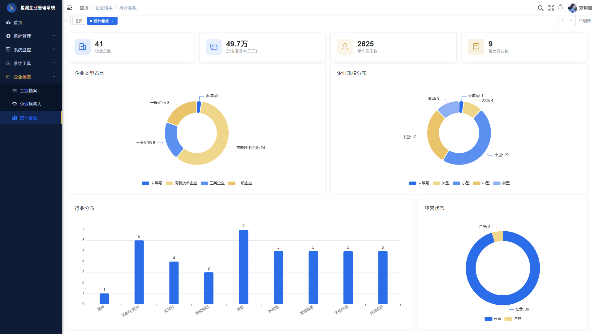
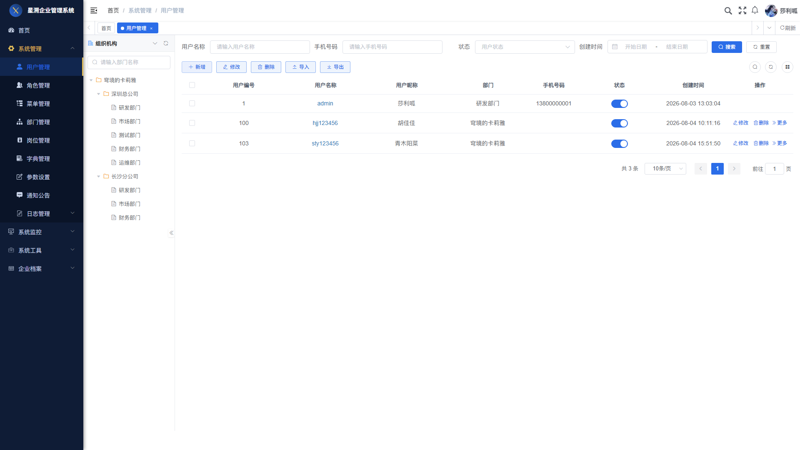
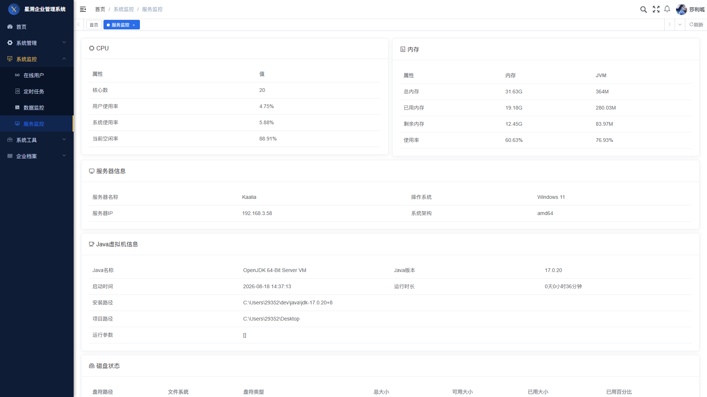

<p align="center">
  
</p>

<h1 align="center">星溯企业管理系统 · StarTrace</h1>

<p align="center">
  <b>企业信息管理 + 多维数据看板 · 全栈自研项目</b><br>
  <i>Enterprise Information Management System with Multi-dimensional Data Dashboard</i>
</p>

<p align="center">
  <a href="https://github.com/Kaalia0912/startrace-system/actions/workflows/build.yml"></a>
  <a href="LICENSE"></a>
  
  
</p>

---

## 📖 项目简介 / Overview

**星溯（StarTrace）** 是一个前后端分离的企业信息管理系统：从数据库设计、前后端开发、性能优化到安全加固、公网部署，全流程独立完成。

不只是增删改查——系统打通了 **「数据生成 → 入库 → 聚合统计 → 可视化看板」** 的完整数据链路：设计企业**多维数据模型**（行业 / 规模 / 类型 / 状态 / 注册资本），通过 SQL 聚合 + ECharts 呈现四维统计看板。

> ⚠️ 数据说明：演示数据为**模拟数据**（Python 生成，41 家企业 / 74 联系人，贴近真实规模），用于验证数据管道与统计逻辑的正确性。

> **StarTrace** is a full-stack, front-end/back-end separated enterprise information management system. Beyond standard CRUD, it features a complete **data pipeline: data generation → MySQL storage → SQL aggregation → ECharts dashboards**, built around a multi-dimensional enterprise data model (industry / scale / type / status / registered capital).

---

## ✨ 核心功能 / Features

| 模块 | 说明 |
|---|---|
| 📋 **企业档案管理** | 企业信息 CRUD、多条件组合搜索、Excel 导入导出 |
| 👥 **联系人管理** | 企业联系人维护，与企业档案关联 |
| 📊 **多维统计看板** | 行业分布 / 企业类型 / 规模分层 / 经营状态四维统计，ECharts 可视化 + 字典映射 |
| 🔐 **RBAC 权限体系** | JWT 认证 + 多级菜单权限控制 + 数据权限 |
| 🛡️ **安全加固** | 验证码、登录失败锁定（5 次 / 10 分钟）、防火墙端口管控、Druid 监控 IP 白名单 |
| ⚡ **性能优化** | 首屏资源 8MB → 200KB（约 10 倍提速），Nginx gzip 预压缩 |

---

## 🖼️ 界面预览 / Screenshots

| 登录页 | 首页仪表盘 |
|:---:|:---:|
|  |  |

| 企业档案列表 | 企业详情 |
|:---:|:---:|
|  |  |

| 企业联系人 | 统计看板 |
|:---:|:---:|
|  |  |

| 系统管理-用户 | 系统监控-服务监控 |
|:---:|:---:|
|  |  |

---

## 🛠️ 技术栈 / Tech Stack

**前端 Frontend**
- Vue 2 + Element UI + ECharts
- Axios / Vue Router / Vuex

**后端 Backend**
- Spring Boot + Spring Security (JWT) + MyBatis
- MySQL 8 / Redis / Druid

**部署 & 工程化 DevOps**
- Nginx（gzip 预压缩、反向代理）
- GitHub Actions CI（自动测试 + 构建）
- 16 个 JUnit 5 + Mockito 单元测试（业务服务层，全部通过）

---

## 🚀 快速开始 / Quick Start

### 环境要求
- JDK 17+ / Maven 3.8+
- MySQL 8.0+ / Redis 6+
- Node.js 16+（前端构建）

### 1. 初始化数据库
```bash
# 1) 创建数据库：CREATE DATABASE ry_vue CHARACTER SET utf8mb4 COLLATE utf8mb4_general_ci;
# 2) 按顺序执行 sql/ 目录下的脚本：
#    ry_20260417.sql      基础框架表（含默认账号 admin / ry）
#    ent_enterprise.sql   企业档案表
#    ent_mock_data.sql    模拟演示数据（41 家企业 / 74 联系人）
#    enterprise_ext_menu.sql / enterprise_menu_dict.sql  菜单与字典
#    quartz.sql           定时任务表
```

### 2. 启动后端
```bash
# 设置数据库密码环境变量（改成你自己的 MySQL 密码）：
#   Windows (PowerShell):  $env:DB_PASSWORD="你的密码"
#   Linux / macOS:         export DB_PASSWORD="你的密码"
# 设置 JWT 签名密钥环境变量（改成你自己的随机密钥，切勿使用示例值）：
#   Windows (PowerShell):  $env:JWT_SECRET="一串足够长的随机字符"
#   Linux / macOS:         export JWT_SECRET="一串足够长的随机字符"
mvn spring-boot:run
# 默认端口 8080
```

### 3. 启动前端
```bash
cd ruoyi-ui
npm install
npm run dev
# 默认地址 http://localhost:80
```

### 4. 访问系统
- 地址：`http://localhost/`
- **默认账号：`admin` / `admin123`**（首次登录后请立即修改密码）
- 测试账号：`ry` / `admin123`

---

## 📁 项目结构 / Structure

```
├── ruoyi-admin      # 启动模块（Web 入口、配置）
├── ruoyi-framework  # 核心框架（安全、拦截器、切面）
├── ruoyi-system     # 业务模块（企业档案、联系人、看板）
├── ruoyi-common     # 通用工具
├── ruoyi-quartz     # 定时任务
├── ruoyi-generator  # 代码生成器
├── ruoyi-ui         # 前端（Vue 2 + Element UI）
├── sql/             # 数据库脚本
└── docs/            # 文档与截图
```

---

## 📄 开源说明 / License

本项目基于 [RuoYi-Vue](https://gitee.com/y_project/RuoYi-Vue)（MIT License）二次开发，遵循 **MIT 协议**。

- 上游项目：若依 RuoYi-Vue v3.9.2（[Gitee](https://gitee.com/y_project/RuoYi-Vue)）
- 本仓库在若依基础上新增：企业档案 / 联系人管理模块、多维统计看板、模拟数据链路、性能优化与安全加固等
- 本项目 README、截图与业务代码为原创内容

---

<p align="center"><i>Made with ❤️ · 星溯 StarTrace</i></p>
